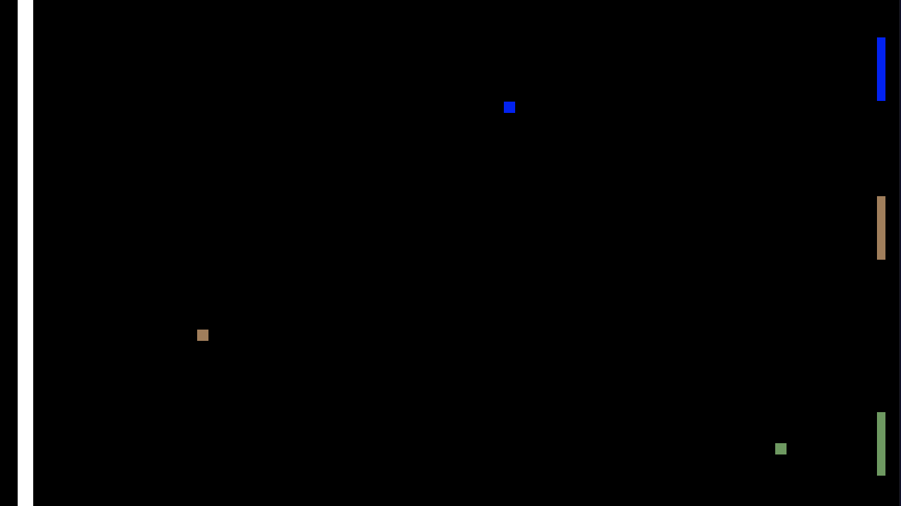
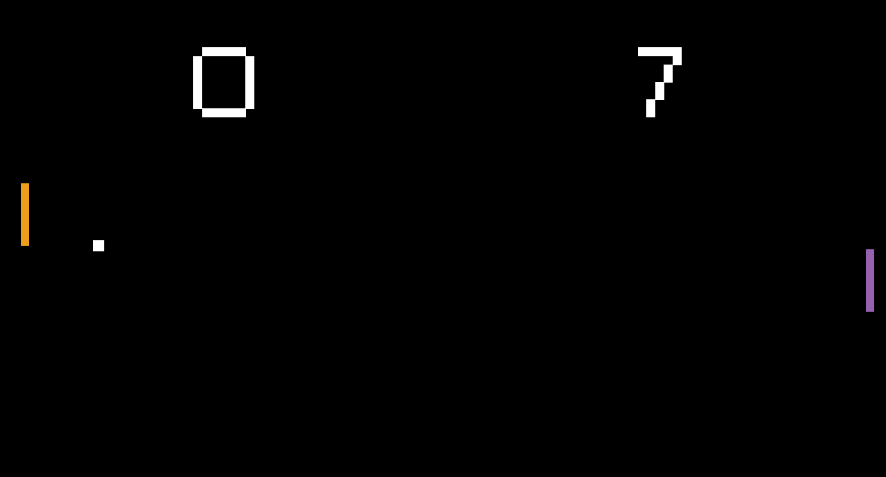
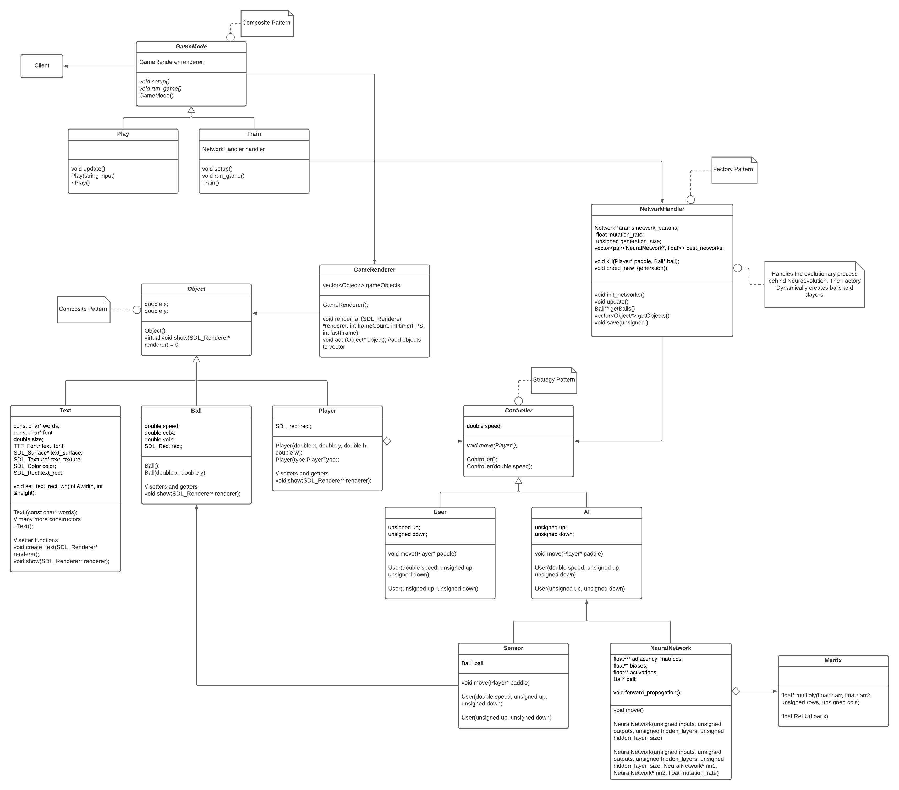

# AI Learns to Play a Simple Game
 > Authors:
 \<[Christopher Vurbenova-Mouri](https://github.com/Quidifer)\>
 \<[Hongting(Kevin) Liang](https://github.com/kevin7816)\>
 \<[Tran Nguyen](https://github.com/trannguyen28)\>
 
 # Summary
 This project trains artificial neural networks to learn how to play the game pong. The client may either train or play against
 an AI.

## Why is it important or interesting to you?
 This project is interesting because it explores the realm of AI. We find it interesting
that an algorithm can learn and adapt on its own using the evolutionary process

## Languages/Tools/Technologies
> (This list may change over the course of the project)
 * C++

 * SDL2 - SDL2 is a library that gives easy access to a visual interface that will display our game

 * Artificial Neural Network - A Neural Network is a very specific type of graph. It uses a mathematical operation called forward
 propagation to make decisions based upon inputs. \>
 
 * Neuroevolution - a form of artificial intelligence that uses evolutionary algorithms to generate artificial neural networks (ANN), parameters, topology and rules. It is most commonly applied in artificial life, general game playing and evolutionary robotics.

## What will be the input/output of your project?
 * This project mainly focuses on teaching AI to play a simple game, so our input would be the game Pong (we will implement it ourselves), and the output would be the AI being able to play the game with a low percentage of losing.
 
## Training
 * Each generation, Neural Network's compete and are evaluated against their peers. The Networks with the highest fitness scores are moved onto the next generation and are breeded with one another. 

 
 
## Playing
 * The user can choose to play on a preset difficulty against a previously trained neural network, or play against any of the networks in the *saves* folder.
 
  

# Design Patterns
 * **Composite**: The composite pattern is used to construct our game objects. We have an abstract class named *Object*, with three derived classes *Text*, *Ball*, and *Player*. These objects are all game objects that have inherited variables and functions from the base class *Object* such as positions.

 * **Strategy**: The strategy pattern is used to make two game modes: play or train AI. The compositor *Controller* declares a common interface for the two derived strategies (which includes necessary functions for controlling and playing the game), then each of the two strategies would have their own algorithm of how the player (user or AI) plays.
   * In the class *User*, we will implement an algorithm to allow the user to play the game themselves.
   * In the class *NeuralNetwork*, we will implement neural network algorithms to train the AI to play the game.

 * **Factory**: The factory pattern is used to dynamically create many different Balls and Players during the training process. Our *Factory* is called *NetworkHandler*. Its job is to create, kill, and breed AI's together. It is given a mutation rate, generation size, network topology, and selection size. The factory then creates many objects, which it then returns to the client every frame after updating object positions. The client uses the *GameRanderer* object to render all of the factory's objects onto the screen.
 
# Class Diagram

* The abstract class *Object* has three derived classes *Text*, *Ball*, and *Player*. These objects are all game objects that have inherited variables and functions from the base class *Object* as well as their own member variables and functions (some are from the SDL Library that we will use for our graphics.)

 * The compositor *Controller* declares a common interface for the two derived strategies: *User* and *NeuralNetwork*.
   * In the class *User*, we will implement an algorithm to allow the user to play the game themselves.
   * In the class *NeuralNetwork*, we will construct multiple layers of the neural network. These layers will work together to perform the arithmetic operations behind forward propagation.

 * The observer *Observer* would observe the user's action which causes objects in the *OptionMenu* to change their states and then notify the concrete observers *DifferentOptions* about the changes. Then, *Train* would take the changes notified to *DifferentOptions* and adjust the neural network's arithmetic operations on how to train the AI based on the user's choices.

 * *GameRender* will be passed all game objects and will render them onto the screen.

 * *NetworkHandler* handles the evolutionary process behind Neuroevolution using a vector holding all *NeuralNetwork* objects.

 * The class *GameMode* is where the Client can interact with the program. It uses a GameRenderer to render all objects and run the game. The user can them choose either of the two game modes: *Play* to play the game themselves or *Train* to customize training options using *OptionMenu* and train their AI to play the game for them.
